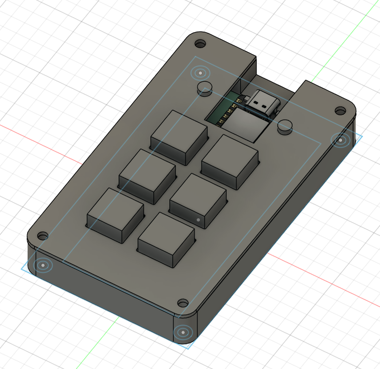
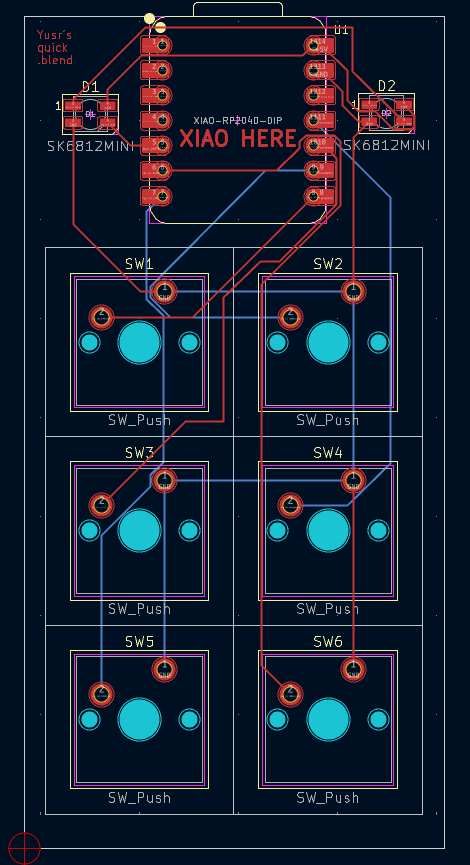
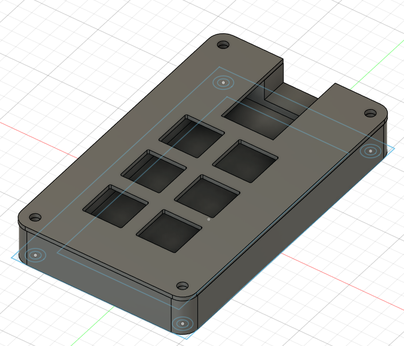

# My Blender Macropad

A custom 6-switch macropad designed to speed up Blender workflow, built with Seeed XIAO RP2040 and KMK firmware.

---

## Screenshots

### Overall Hackpad

### Schematic

### PCB Layout

### Case Assembly

> The case is 3D printed and fully encloses the PCB. The XIAO USB port lines up with the raised hole for easy access.

---

## Bill of Materials (BOM)

| Quantity | Part | Description |
|----------|------|-------------|
| 1 | Seeed XIAO RP2040 | Main MCU |
| 6 | Mechanical Switches | Standard keyboard switches |
| 2 | SK6812 MINI LEDs | Neopixel RGB LEDs |
| 1 | Custom PCB | 2-layer KiCAD design |
| 1 | 3D Printed Case | Top + Bottom parts |
| Misc | Wires / Solder | Connections |

---

## Firmware

The firmware uses [KMK](https://github.com/KMKfw/kmk_firmware) and a custom `main.py`:

- Keys mapped for Blender workflow:
  - Undo → Ctrl+Z
  - Redo → Ctrl+Y
  - Duplicate → Shift+D
  - Save → Ctrl+S
  - X-Ray → Alt+Z
  - Wireframe → Z → 4

---

## Notes

- The PCB fits perfectly inside the 3D printed case.  
- All parts are approved for the project.  
- Only 6 switches used (<16 max allowed).  
- The CAD file (`final.step`) shows the full assembly including the PCB and case.
